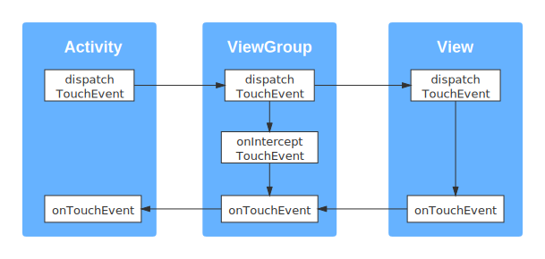

## Android事件分发机制

### 一、概述

#### 1. 事件

事件通常指触摸或点击事件，用户触摸屏幕时产生 `Touch` 事件。`Touch` 事件的相关细节封装于 `MotionEvent` 对象中。

| 事件类型                   | 具体动作        |
| ------------------------- | ------------- |
| MotionEvent.ACTION_DOWN   | 按下事件（开始） |
| MotionEvent.ACTION_UP     | 抬起事件（结束） |
| MotionEvent.ACTION_MOVE   | 滑动事件        |
| MotionEvent.ACTION_CANCEL | 取消事件        |

#### 2. 分发流程



如上图所示，onTouch事件产生后，先传给Activity，再传给View Group，最后传给View。

事件分发流程的目的就是要找到第一个要处理事件的对象。一旦有一个对象消费了该事件，事件分发结束。反之，如果事件没有被消费，则会被废弃。

#### 3. 重要方法

| 方法                                                | 作用         |
| --------------------------------------------------- | ------------ |
| dispatchTouchEvent(event: MotionEvent?): Boolean    | 进行事件分发 |
| onInterceptTouchEvent(event: MotionEvent?): Boolean | 进行事件拦截 |
| onTouchEvent(event: MotionEvent?): Boolean          | 进行事件消耗 |

三个方法之间的关系可以使用如下为代码表示：

```kotlin
fun dispatchTouchEvent(ev: MotionEvent?): Boolean {
    val consume = false
    if (onInterceptTouchEvent(ev)) {
        consume = onTouchEvent(ev)
    } else {
        consume = child.dispatchTouchEvent(ev)
    }
    return consume
}
```

**事件的传递规则**：对于ViewGroup，点击事件传递过来后，首先调用 `dispatchTouchEvent` 方法。如果其 `onInterceptTouchEvent` 方法返回true，表示拦截该事件，随后它的 `onTouch` 方法被调用；如果 `onInterceptTouchEvent` 方法返回false，表示不拦截事件，该事件会继续传递给子View，接着子View的 `dispatchTouchEvent` 方法被调用。重复该过程直至事件被消耗。


### 二、Activity的事件分发

#### 1. Demo演示

(1) 重写Activity的 `dispatchTouchEvent` 和 `onTouchEvent` 方法。

```kotlin
class MainActivity : AppCompatActivity() {
    companion object {
        const val TAG = "Activity"
    }
    
    override fun onCreate(savedInstanceState: Bundle?) {
        super.onCreate(savedInstanceState)
        setContentView(R.layout.activity_main)
    }

    override fun dispatchTouchEvent(ev: MotionEvent?): Boolean {
        val eventName = EventUtil.getActionName(ev)
        LogUtil.i(TAG, "dispatchTouchEvent $eventName Start", LogUtil.Depth.ACTIVITY)
        val result = super.dispatchTouchEvent(ev)
        LogUtil.i(TAG, "dispatchTouchEvent $eventName End with $result", LogUtil.Depth.ACTIVITY)
        return result
    }

    override fun onTouchEvent(event: MotionEvent?): Boolean {
        val eventName = EventUtil.getActionName(event)
        LogUtil.i(TAG, "onTouchEvent $eventName", LogUtil.Depth.ACTIVITY)
        return super.onTouchEvent(event)
    }
}
```

(2) 自定义MyLayout （继承自FrameLayout） 并重写 `dispatchTouchEvent方法`。

```kotlin
class MyLayout : FrameLayout {
    companion object {
        const val TAG = "MyLayout"
    }

    constructor(context: Context) : super(context)
    constructor(context: Context, attrs: AttributeSet) : super(context, attrs)

    override fun dispatchTouchEvent(ev: MotionEvent?): Boolean {
        val eventName = EventUtil.getActionName(ev)
        val result = false  // false or true
        LogUtil.i(TAG, "dispatchTouchEvent $eventName End with $result", LogUtil.Depth.VIEW_GROUP)
        return result
    }
}
```

(3) activity_main.xml

```xml
<com.example.eventdispatch.ui.MyLayout
    xmlns:android="http://schemas.android.com/apk/res/android"
    android:layout_width="200dp"
    android:layout_height="200dp"
    android:layout_gravity="center"
    android:background="@color/colorPrimary"
    android:gravity="center">
</com.example.eventdispatch.ui.MyLayout>
```

当MyLayout `dispatchTouchEvent` 返回false时，表示其不对事件进行分发。ACTION_DOWN事件传递到MyLayout时，`dispatchTouchEvent` 被调用，返回false，事件返回给Activity，Activity的 `onTouchEvent` 被调用。当ACTION_MOVE或ACTION_UP事件到来时，由于上一个事件由Activity处理，因此该事件不再向下传递，直接交给Activity处理。点击MyLayout，打印的Log如下：

```
I/Activity:     dispatchTouchEvent ACTION_DOWN Start
I/  MyLayout:   dispatchTouchEvent ACTION_DOWN End with false
I/Activity:     onTouchEvent ACTION_DOWN
I/Activity:     dispatchTouchEvent ACTION_DOWN End with false
I/Activity:     dispatchTouchEvent ACTION_UP Start
I/Activity:     onTouchEvent ACTION_UP
I/Activity:     dispatchTouchEvent ACTION_UP End with false
```

当MyLayout `dispatchTouchEvent` 返回true时，事件被MyLayout消耗，Activity的 `onTouchEvent` 不会被调用。点击MyLayout，打印的Log如下：

```
I/Activity:     dispatchTouchEvent ACTION_DOWN Start
I/  MyLayout:   dispatchTouchEvent ACTION_DOWN End with true
I/Activity:     dispatchTouchEvent ACTION_DOWN End with true
I/Activity:     dispatchTouchEvent ACTION_UP Start
I/  MyLayout:   dispatchTouchEvent ACTION_UP End with true
I/Activity:     dispatchTouchEvent ACTION_UP End with true
```

#### 2. 源码分析

> 注: 本文所有源码为API Level 29

点击事件产生后，最先传递给当前Activity，Activity的 `dispatchTouchEvent` 方法被调用。

Activity的 `dispatchTouchEvent` 方法如下：

```java
/**
 * Acticity.java
 * Line 3989-3997
 */
public boolean dispatchTouchEvent(MotionEvent ev) {
    if (ev.getAction() == MotionEvent.ACTION_DOWN) {
        // 空方法
        onUserInteraction();
    }
    if (getWindow().superDispatchTouchEvent(ev)) {
        return true;
    }
    return onTouchEvent(ev);
}
```

可以看到，事件首先交给Activity所属的Window进行分发，如果返回true，则事件分发结束；如果返回false，意味着事件没有被处理，Activity的 `onTouchEvent` 被调用。

`getWindow` 返回Window对象，Window是一个抽象类，PhoneWindow是其唯一的实现类。因此 `getWindow().superDispatchTouchEvent(ev)` 就是调用PhoneWindow的 `superDispatchTouchEvent(ev)` 方法。

PhoneWindow的 `superDispatchTouchEvent` 方法如下：

```java
/**
 * PhoneWindow.java
 * Line 1847-1850
 */
@Override
public boolean superDispatchTouchEvent(MotionEvent event) {
    return mDecor.superDispatchTouchEvent(event);
}
```

PhoneWindow将事件传递给了DecorView对象mDecor，mDecor是 `getWindow().getDecorView()` 返回的View，Activity中通过 `setContentView` 设置的View是它的一个子View。

DecorView的 `superDispatchTouchEvent` 方法如下：

```java
/**
 * DecorView.java
 */
public class DecorView extends FrameLayout implements RootViewSurfaceTaker, WindowCallbacks{
    // // ...
    // Line464-466
    public boolean superDispatchTouchEvent(MotionEvent event) {
        return super.dispatchTouchEvent(event);
    }
}
```

DecorView继承自FramgLayout，FrameLayout又继承自ViewGroup，所以 `mDecor.superDispatchTouchEvent(event)` 其实就是调用ViewGroup的 `dispatchTouchEvent` 方法。至此，事件已经分发给ViewGroup了。

#### 3. 分发流程图


### 三、ViewGroup的事件分发

#### 1. Demo演示

(1) 自定义MyLayout （继承自FrameLayout） 并重写 `dispatchTouchEvent` 方法、`onInterceptTouchEvent` 方法、`onTouchEvent` 方法。

```kotlin
class MyLayout : FrameLayout {
    companion object {
        const val TAG = "MyLayout"
    }

    constructor(context: Context) : super(context)
    constructor(context: Context, attrs: AttributeSet) : super(context, attrs)

    override fun dispatchTouchEvent(ev: MotionEvent?): Boolean {
        val eventName = EventUtil.getActionName(ev)
        LogUtil.i(TAG, "dispatchTouchEvent $eventName Start", LogUtil.Depth.VIEW_GROUP)
        val result = super.dispatchTouchEvent(ev)
        LogUtil.i(TAG, "dispatchTouchEvent $eventName End with $result", LogUtil.Depth.VIEW_GROUP)
        return result
    }

    override fun onInterceptTouchEvent(ev: MotionEvent?): Boolean {
        val eventName = EventUtil.getActionName(ev)
        LogUtil.i(TAG, "onInterceptTouchEvent $eventName Start", LogUtil.Depth.VIEW_GROUP)
        val result = false  // false or true
        LogUtil.i(TAG, "onInterceptTouchEvent $eventName End with $result", LogUtil.Depth.VIEW_GROUP)
        return result
    }

    override fun onTouchEvent(event: MotionEvent?): Boolean {
        val eventName = EventUtil.getActionName(event)
        LogUtil.i(TAG, "onTouchEvent $eventName Start", LogUtil.Depth.VIEW_GROUP)
        val result = super.onTouchEvent(event)
        LogUtil.i(TAG, "onTouchEvent $eventName End with $result", LogUtil.Depth.VIEW_GROUP)
        return result
    }
}
```

(2) activity_main.xml

```xml
<com.example.eventdispatch.ui.MyLayout
    xmlns:android="http://schemas.android.com/apk/res/android"
    android:layout_width="200dp"
    android:layout_height="200dp"
    android:layout_gravity="center"
    android:background="@color/colorPrimary"
    android:gravity="center">

    <Button
        android:id="@+id/my_button"
        android:layout_width="wrap_content"
        android:layout_height="wrap_content"
        android:layout_gravity="center"
        android:text="Button" />

</com.example.eventdispatch.ui.MyLayout>
```

(3) MainActivity中，为button添加点击事件。

```kotlin
class MainActivity : AppCompatActivity() {
    companion object {
        const val TAG = "Activity"
    }

    private lateinit var button: Button

    override fun onCreate(savedInstanceState: Bundle?) {
        super.onCreate(savedInstanceState)
        setContentView(R.layout.activity_main)
        button = findViewById(R.id.my_button)
        button.setOnClickListener {
            LogUtil.i(MyLayout.TAG, "onClick", LogUtil.Depth.VIEW_GROUP)
        }
    }
    
    // ...
}
```

当MyLayout的 `onInterceptTouchEvent` 方法返回false时，点击button，打印的Log如下：

```
I/Activity:     dispatchTouchEvent ACTION_DOWN Start
I/  MyLayout:   dispatchTouchEvent ACTION_DOWN Start
I/  MyLayout:   onInterceptTouchEvent ACTION_DOWN Start
I/  MyLayout:   onInterceptTouchEvent ACTION_DOWN End with false
I/  MyLayout:   dispatchTouchEvent ACTION_DOWN End with true
** I/Activity:     dispatchTouchEvent ACTION_DOWN End with true **
I/Activity:     dispatchTouchEvent ACTION_UP Start
I/  MyLayout:   dispatchTouchEvent ACTION_UP Start
I/  MyLayout:   onInterceptTouchEvent ACTION_UP Start
I/  MyLayout:   onInterceptTouchEvent ACTION_UP End with false
I/  MyLayout:   dispatchTouchEvent ACTION_UP End with true
I/Activity:     dispatchTouchEvent ACTION_UP End with true
I/  MyLayout:   onClick
```

可以看出，此时按钮的点击事件触发，但是MyLayout的 `onTouchEvent` 方法未被调用。说明MyLayout并没有拦截事件，而是将它传递给了button。

当MyLayout的 `onInterceptTouchEvent` 方法返回true时，点击button，打印的Log如下：

```
I/Activity:     dispatchTouchEvent ACTION_DOWN Start
I/  MyLayout:   dispatchTouchEvent ACTION_DOWN Start
I/  MyLayout:   onInterceptTouchEvent ACTION_DOWN Start
I/  MyLayout:   onInterceptTouchEvent ACTION_DOWN End with true
I/  MyLayout:   onTouchEvent ACTION_DOWN Start
I/  MyLayout:   onTouchEvent ACTION_DOWN End with false
I/  MyLayout:   dispatchTouchEvent ACTION_DOWN End with false
I/Activity:     onTouchEvent ACTION_DOWN
I/Activity:     dispatchTouchEvent ACTION_DOWN End with false
I/Activity:     dispatchTouchEvent ACTION_UP Start
I/Activity:     onTouchEvent ACTION_UP
I/Activity:     dispatchTouchEvent ACTION_UP End with false
```

这种情况下按钮的点击事件没有触发，但是MyLayout的 `onTouchEvent` 方法被调用。说明MyLayout拦截了事件，没有将它传递给button。

#### 2. 源码分析

如上所述，Activity在 `dispatchTouchEvent` 方法内将点击事件传递给了ViewGroup的 `dispatchTouchEvent` 方法。

ViewGroup的 `dispacthTouchEvent` 方法如下：

```java
/**
 * ViewGroup.java
 * Line 2577-2791
 */
@Override
public boolean dispatchTouchEvent(MotionEvent ev) {
    boolean handled = false;
    if (onFilterTouchEventForSecurity(ev)) {
        // ...
    }
    if (!handled && mInputEventConsistencyVerifier != null) {
        mInputEventConsistencyVerifier.onUnhandledEvent(ev, 1);
    }
    return handled;
}
```

不难看出，ViewGroup的 `dispatchTouchEvent` 的方法返回handled的值，默认为false。而改变handled值的部分位于第一个if块内，`dispatchTouchEvent` 被调用时首先进入 `onFilterTouchEventForSecurity(ev)` 方法。

 `onFilterTouchEventForSecurity(ev)` 方法如下：

```java
/**
 * View.java
 * Line 13474-13482
 */
public boolean onFilterTouchEventForSecurity(MotionEvent event) {
    if ((mViewFlags & FILTER_TOUCHES_WHEN_OBSCURED) != 0
            && (event.getFlags() & MotionEvent.FLAG_WINDOW_IS_OBSCURED) != 0) {
        return false;
    }
    return true;
}
```

if语句块表示如果该视图不位于顶部，并且有属性设置不在顶部时不响应事件，则不分发该事件。

`FILTER_TOUCHES_WHEN_OBSCURED` 与 `android:filterTouchWhenObscured` 属性相对应，如果为true，表示有其他视图在该视图之上，该视图不响应触摸事件。

`MotionEvent.FLAG_WINDOW_IS_OBSCURED` 为true表示该窗口被隐藏。

当没有设置相关属性时，`onFilterTouchEventForSecurity(ev)` 方法返回true。因此分发过程都会进入`if (onFilterTouchEventForSecurity(ev))` 语句块内，其内容如下：

```java
if (onFilterTouchEventForSecurity(ev)) {
    // Line 2591-2601
    final int action = ev.getAction();
    final int actionMasked = action & MotionEvent.ACTION_MASK;

    if (actionMasked == MotionEvent.ACTION_DOWN) {
        cancelAndClearTouchTargets(ev);
        resetTouchState();
    }
    // ...
}
```

其中 `cancelAndClearTouchTargets` 方法和 `resetTouchState` 方法的作用是在点击后重置触摸状态。

```java
if (onFilterTouchEventForSecurity(ev)) {
    // Line 2604-2618
    final boolean intercepted;
    if (actionMasked == MotionEvent.ACTION_DOWN
            || mFirstTouchTarget != null) {
        final boolean disallowIntercept = (mGroupFlags & FLAG_DISALLOW_INTERCEPT) != 0;
        if (!disallowIntercept) {
            intercepted = onInterceptTouchEvent(ev);
            ev.setAction(action);
        } else {
            intercepted = false;
        }
    } else {
        intercepted = true;
    }
}
```

`disallowIntercept` 代表禁用事件拦截功能，默认为false。进入到`if (!disallowIntercept)` 语句块内，调用 `onInterceptTouchEvent` 方法。

`onInterceptTouchEvent` 方法如下：

```java
/**
 * ViewGroup.java
 * Line 3224-3232
 */
public boolean onInterceptTouchEvent(MotionEvent ev) {
    if (ev.isFromSource(InputDevice.SOURCE_MOUSE)
            && ev.getAction() == MotionEvent.ACTION_DOWN
            && ev.isButtonPressed(MotionEvent.BUTTON_PRIMARY)
            && isOnScrollbarThumb(ev.getX(), ev.getY())) {
        return true;
    }
    return false;
}
```

在上一个if语句块内`intercepted = onInterceptTouchEvent(ev)`，如果不拦截，则 `intercepted` 为false，进入`if (!canceled && !intercepted)` 语句块。

```java
if (onFilterTouchEventForSecurity(ev)) {
    // Line 2634-2736
    if (!canceled && !intercepted) {
        // ...
        if (actionMasked == MotionEvent.ACTION_DOWN
                || (split && actionMasked == MotionEvent.ACTION_POINTER_DOWN)
                || actionMasked == MotionEvent.ACTION_HOVER_MOVE) {

            // ...
            final int childrenCount = mChildrenCount;
            if (newTouchTarget == null && childrenCount != 0) {
                // ...
                for (int i = childrenCount - 1; i >= 0; i--) {
                    // 判断子元素能够接受点击事件
                    if (!child.canReceivePointerEvents()
                            || !isTransformedTouchPointInView(x, y, child, null)) {
                        ev.setTargetAccessibilityFocus(false);
                        continue;
                    }

                    newTouchTarget = getTouchTarget(child);
                    if (newTouchTarget != null) {
                        newTouchTarget.pointerIdBits |= idBitsToAssign;
                        break;
                    }

                    // 调用子元素的dispatchTouchEvent方法
                    resetCancelNextUpFlag(child);
                    if (dispatchTransformedTouchEvent(ev, false, child, idBitsToAssign){
                        // ...
                    }
                    // ...
                }
                // ...
            }
        }
    }
    if (mFirstTouchTarget == null) {
    // No touch targets so treat this as an ordinary view.
    handled = dispatchTransformedTouchEvent(ev, canceled, null,
            TouchTarget.ALL_POINTER_IDS);
    }
}
```

在该语句块内，可以看到通过for循环遍历所有子元素，判断每个子元素是否可以接受点击事件：(1) `canReceivePointerEvents` 判断事件的坐标是否落在子元素的区域内；(2) `isTransformedTouchPointInView ` 判断子元素是否在播放动画。判断结束后执行ViewGroup的 `dispatchTransformedTouchEvent` 方法。

如果 `intercepted` 为true，则ViewGroup拦截事件。此时不会进入第3行的if语句。又由于没有对mFirstTouchTarget赋值，因此进入`if (mFirstTouchTarget == null) `语句块，执行ViewGroup的 `dispatchTransformedTouchEvent` 方法。

`dispatchTransformedTouchEvent`方法如下：

```java
/**
 * ViewGroup.java
 */
private boolean dispatchTransformedTouchEvent(MotionEvent event, boolean cancel,
        View child, int desiredPointerIdBits) {
    // Line 3072-3087
    if (child == null) {
        handled = super.dispatchTouchEvent(transformedEvent);
    } else {
        final float offsetX = mScrollX - child.mLeft;
        final float offsetY = mScrollY - child.mTop;
        transformedEvent.offsetLocation(offsetX, offsetY);
        if (! child.hasIdentityMatrix()) {
            transformedEvent.transform(child.getInverseMatrix());
        }

        handled = child.dispatchTouchEvent(transformedEvent);
    }

    transformedEvent.recycle();
    return handled;    
}
```

不难发现，当参数child为null时，对应上述`intercepted` 为true的情况，此时调用 `super.dispatchTouchEvent(event)`，即 `View.dispatchTouchEvent(event)`，事件由ViewGroup处理；当child不为null时，对应上述`intercepted` 为false的情况，此时调用 `child.dispatchTouchEvent(event)` 方法，事件由ViewGroup分发至View。

#### 3. 分发流程图


### 四、View的事件分发

#### 1. Demo演示

(1) 自定义MyButton（继承自AppCompatButton）并重写 `dispatchTouchEvent` 方法、`onInterceptTouchEvent` 方法。

```kotlin
class MyButton : AppCompatButton {
    companion object {
        const val TAG = "MyButton"
    }

    constructor(context: Context) : super(context)
    constructor(context: Context, attrs: AttributeSet) : super(context, attrs)

    override fun dispatchTouchEvent(event: MotionEvent?): Boolean {
        val eventName = EventUtil.getActionName(event)
        LogUtil.i(TAG, "dispatchTouchEvent $eventName Start", LogUtil.Depth.VIEW)
        val result = super.dispatchTouchEvent(event)
        LogUtil.i(TAG, "dispatchTouchEvent $eventName End with $result", LogUtil.Depth.VIEW)
        return result
    }

    override fun onTouchEvent(event: MotionEvent?): Boolean {
        val eventName = EventUtil.getActionName(event)
        LogUtil.i(TAG, "onTouchEvent $eventName", LogUtil.Depth.VIEW)
        return super.onTouchEvent(event)
    }
}
```

(2) activity_main.xml

```xml
<com.example.eventdispatch.ui.MyLayout
    xmlns:android="http://schemas.android.com/apk/res/android"
    android:id="@+id/my_layout"
    android:layout_width="200dp"
    android:layout_height="200dp"
    android:layout_gravity="center"
    android:background="@color/colorPrimary"
    android:gravity="center">

    <com.example.eventdispatch.ui.MyButton
        android:id="@+id/my_button"
        android:layout_width="wrap_content"
        android:layout_height="wrap_content"
        android:layout_gravity="center"
        android:text="Button" />
</com.example.eventdispatch.ui.MyLayout>
```

(3) 在MainActivity中为myButton添加 `OnTouchListener` 和 `OnClickListener`。

```kotlin
class MainActivity : AppCompatActivity() {
    companion object {
        const val TAG = "Activity"
    }

    private lateinit var myButton: MyButton

    override fun onCreate(savedInstanceState: Bundle?) {
        super.onCreate(savedInstanceState)
        setContentView(R.layout.activity_main)
        myButton = findViewById(R.id.my_button)
        myButton.apply {
            setOnTouchListener { _, ev ->
                val eventName = EventUtil.getActionName(ev)
                LogUtil.i(MyButton.TAG, "onTouch $eventName", LogUtil.Depth.VIEW)
                false
            }
            setOnClickListener {
                LogUtil.i(MyButton.TAG, "onClick", LogUtil.Depth.VIEW)
            }
        }
    }
}
```

当myButton的 `onTouch` 返回false时，打印的Log如下：

```
I/Activity:     dispatchTouchEvent ACTION_DOWN Start
I/  MyLayout:   dispatchTouchEvent ACTION_DOWN Start
I/  MyLayout:   onInterceptTouchEvent ACTION_DOWN Start
I/  MyLayout:   onInterceptTouchEvent ACTION_DOWN End with false
I/    MyButton: dispatchTouchEvent ACTION_DOWN Start
I/    MyButton: onTouch ACTION_DOWN
I/    MyButton: onTouchEvent ACTION_DOWN
I/    MyButton: dispatchTouchEvent ACTION_DOWN End with true
I/  MyLayout:   dispatchTouchEvent ACTION_DOWN End with true
I/Activity:     dispatchTouchEvent ACTION_DOWN End with true
I/Activity:     dispatchTouchEvent ACTION_UP Start
I/  MyLayout:   dispatchTouchEvent ACTION_UP Start
I/  MyLayout:   onInterceptTouchEvent ACTION_UP Start
I/  MyLayout:   onInterceptTouchEvent ACTION_UP End with false
I/    MyButton: dispatchTouchEvent ACTION_UP Start
I/    MyButton: onTouch ACTION_UP
I/    MyButton: onTouchEvent ACTION_UP
I/    MyButton: dispatchTouchEvent ACTION_UP End with true
I/  MyLayout:   dispatchTouchEvent ACTION_UP End with true
I/Activity:     dispatchTouchEvent ACTION_UP End with true
I/    MyButton: onClick
```

`onTouch`返回true时，打印的Log如下：

```
I/Activity:     dispatchTouchEvent ACTION_DOWN Start
I/  MyLayout:   dispatchTouchEvent ACTION_DOWN Start
I/  MyLayout:   onInterceptTouchEvent ACTION_DOWN Start
I/  MyLayout:   onInterceptTouchEvent ACTION_DOWN End with false
I/    MyButton: dispatchTouchEvent ACTION_DOWN Start
I/    MyButton: onTouch ACTION_DOWN
I/    MyButton: dispatchTouchEvent ACTION_DOWN End with true
I/  MyLayout:   dispatchTouchEvent ACTION_DOWN End with true
I/Activity:     dispatchTouchEvent ACTION_DOWN End with true
I/Activity:     dispatchTouchEvent ACTION_UP Start
I/  MyLayout:   dispatchTouchEvent ACTION_UP Start
I/  MyLayout:   onInterceptTouchEvent ACTION_UP Start
I/  MyLayout:   onInterceptTouchEvent ACTION_UP End with false
I/    MyButton: dispatchTouchEvent ACTION_UP Start
I/    MyButton: onTouch ACTION_UP
I/    MyButton: dispatchTouchEvent ACTION_UP End with true
I/  MyLayout:   dispatchTouchEvent ACTION_UP End with true
I/Activity:     dispatchTouchEvent ACTION_UP End with true
```

对比发现，当View的 `onTouch` 返回false时，`onTouchEvent` 和 `onClick` 都被调用，返回true时，二者都不会被调用。据此分析：`onClick` 方法在 `onTouchEvent` 方法中被调用。

#### 2. 源码分析

如上所述，当ViewGroup的child（即子View）不为null时，子View的 `dispatchTouchEvent` 方法被调用。

View的 `dispatchTouchEvent` 方法如下：

```java
/**
 * View.java
 * Line 13395-13449
 */
public boolean dispatchTouchEvent(MotionEvent event) {
    // ...
    boolean result = false;
    // ...
    if (onFilterTouchEventForSecurity(event)) {
        if ((mViewFlags & ENABLED_MASK) == ENABLED && handleScrollBarDragging(event)) {
            result = true;
        }
        ListenerInfo li = mListenerInfo;
        if (li != null && li.mOnTouchListener != null
                && (mViewFlags & ENABLED_MASK) == ENABLED
                && li.mOnTouchListener.onTouch(this, event)) {
            result = true;
        }

        if (!result && onTouchEvent(event)) {
            result = true;
        }
    }
    // ...
    return result;
}
```

`li.mOnTouchListener` 表示View的`OnTouchListener`，如果通过 `setOnTouchListener` 方法为View设置监听事件，则 `li.mOnTouchListener` 不为空。`(mViewFlags & ENABLED_MASK) == ENABLED` 代表View `enable`。

当设置 `onTouch`监听事件并返回false时，14行的if语句判断条件为false，进入 `if (!result && onTouchEvent(event))` 内，View的 `onTouchEvent` 方法被调用；如果 `onTouch` 返回true，进入第14行的if语句块，result被置为true，因此20行的 `onTouchEvent` 方法不会被调用。

`onTouchEvent` 方法如下：

```java
/**
 * View.java
 * Line 14754-14962
 */
public boolean onTouchEvent(MotionEvent event) {
    // ...
    final boolean clickable = ((viewFlags & CLICKABLE) == CLICKABLE
            || (viewFlags & LONG_CLICKABLE) == LONG_CLICKABLE)
            || (viewFlags & CONTEXT_CLICKABLE) == CONTEXT_CLICKABLE;
    
    // ...

    if (clickable || (viewFlags & TOOLTIP) == TOOLTIP) {
        switch (action) {
            case MotionEvent.ACTION_UP:
                // ...
                boolean prepressed = (mPrivateFlags & PFLAG_PREPRESSED) != 0;
                if ((mPrivateFlags & PFLAG_PRESSED) != 0 || prepressed) {
                    boolean focusTaken = false;
                    if (isFocusable() && isFocusableInTouchMode() && !isFocused()) {
                        focusTaken = requestFocus();
                    }

                    if (prepressed) {
                        setPressed(true, x, y);
                    }

                    if (!mHasPerformedLongPress && !mIgnoreNextUpEvent) {
                        removeLongPressCallback();
                        
                        if (!focusTaken) {
                            if (mPerformClick == null) {
                                mPerformClick = new PerformClick();
                            }
                            if (!post(mPerformClick)) {
                                performClickInternal();
                            }
                        }
                    }
                    // ...
                }
                // ...
                break;
                // ...
        }

        return true;
    }

    return false;
}
```

如果View的 `clickable` 或 `longClickable` 有一个为true，将会进入switch语句，并且在 action为`MotionEvent.ACTION_UP` 时，执行36行的 `performClickInternal` 方法，该方法内部又调用了 `performClick` 方法。

`performClick` 方法如下：

```java
/**
 * View.java
 * Line 7131-7151
 */
public boolean performClick() {
    notifyAutofillManagerOnClick();

    final boolean result;
    final ListenerInfo li = mListenerInfo;
    if (li != null && li.mOnClickListener != null) {
        playSoundEffect(SoundEffectConstants.CLICK);
        li.mOnClickListener.onClick(this);
        result = true;
    } else {
        result = false;
    }

    sendAccessibilityEvent(AccessibilityEvent.TYPE_VIEW_CLICKED);

    notifyEnterOrExitForAutoFillIfNeeded(true);

    return result;
}
```

如果View设置了 `OnClickListener`，则会执行12行，调用 `onClick` 方法。这印证了上面Demo演示中的分析：`onClick` 方法在 `onTouchEvent` 方法中被调用。

#### 3. 分发流程图


### 参考文章

[Android事件分发机制详解](https://juejin.im/post/6844903901712351240)

[Android事件分发机制完全解析，带你从源码的角度彻底理解(上)](https://blog.csdn.net/guolin_blog/article/details/9097463)

[Android事件分发机制完全解析，带你从源码的角度彻底理解(下)](https://blog.csdn.net/guolin_blog/article/details/9153747)

[Understanding Android touch flow control](https://medium.com/mobile-app-development-publication/understanding-android-touch-flow-control-bcc413e6a57e)

Android开发艺术探索，任玉刚，电子工业出版社，2015.9