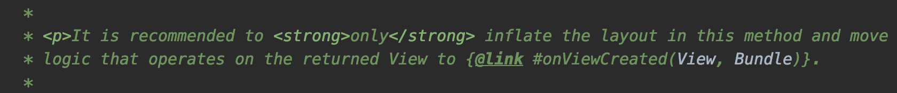
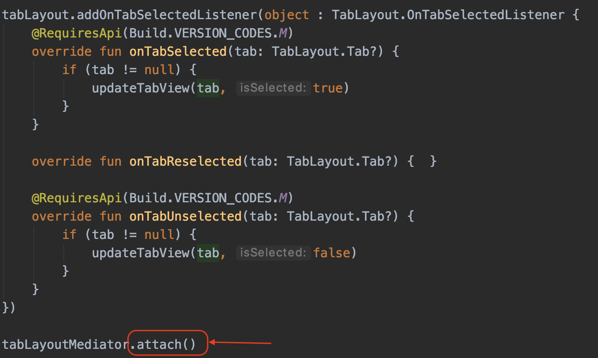
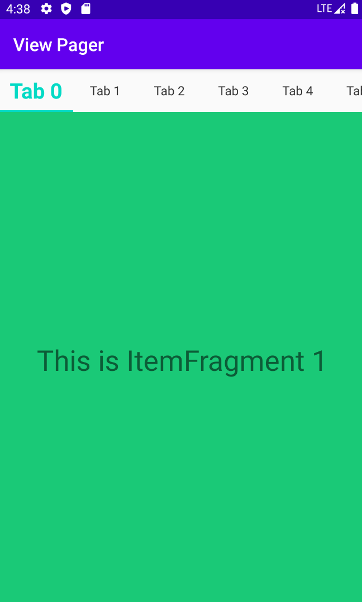
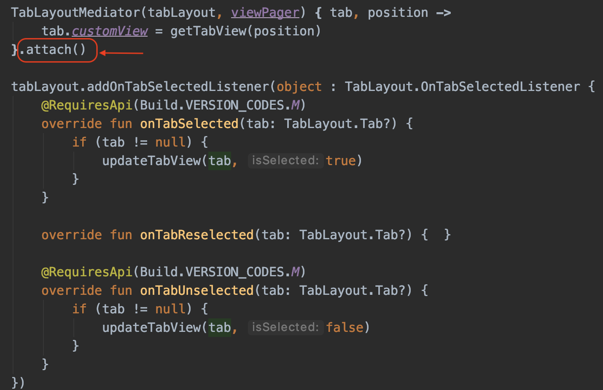
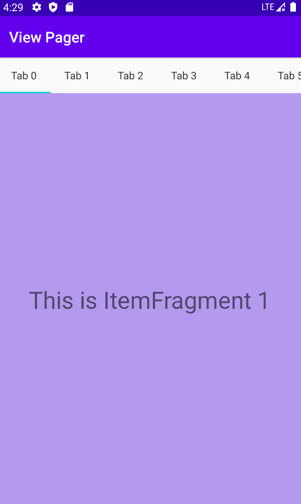

## Fragment + TabLayout + ViewPager2构建滑动标签页

#### Fragment生命周期

注：`onCreateView()`与`onViewCreated()`的区别：

`onViewCreated()`在`onCreateView()`返回之后立即执行。应该在 `onCreateView()`中渲染布局，在`onViewCreated()`中进行其他View的初始化与逻辑的编写。

##### 注意点

`TabLayout`的`addOnTabSelectedListener()`方法应该放在`TabLayoutMediator`的`attach()`方法之前。否则初始化之后选择的Tab不会执行`addOnTabSelectedListener()`中的方法。

<figure>

正确用法

</figure>

<figure style="backgroud: #ff0000">

</figure>

错误用法

